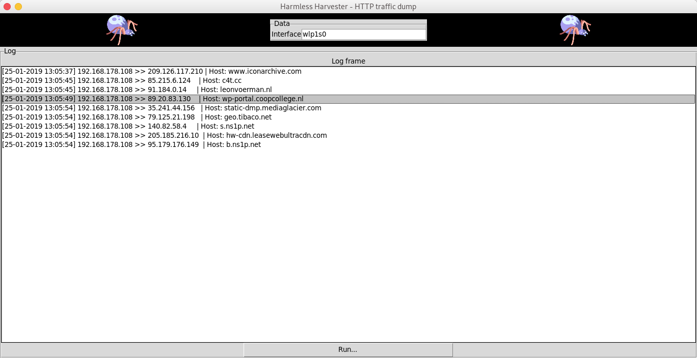

# HarmlessHarvester
Harmless port 80 data harvester

This script shows the internet has a cluster bomb effect when visiting a website.

Also used to find unencrypted domains along side with the HTTPS Everywhere browser plugin
